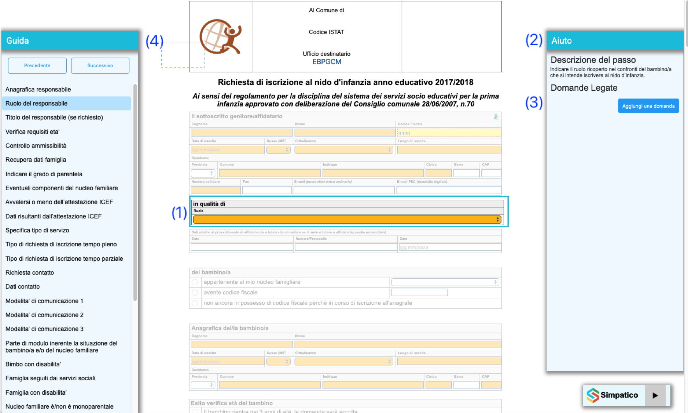
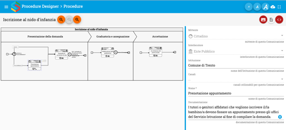
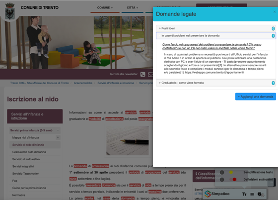

# SPRINT - Collaborative Procedure Designer (CPD)

Il Collaborative Procedure Designer (CPD) è un'applicazione e server web che fornisce servizi per il
diesgno collaborativo e la consultazione di procedure amministrative sotto forma di diagrammi in una
notazione grafica sviluppata nell'ambito del progetto
[SIMPATICO](https://www.simpatico-project.eu/).  

# Descrizione

Il progetto SPRINT intende valorizzare alcuni risultati del progetto
[SIMPATICO](https://www.simpatico-project.eu/) volti a migliorare e semplificare l’interazione tra
cittadino e servizi online. L’obiettivo del progetto è di creare un kit che permetta una facile
integrazione di alcune funzioni avanzate di SIMPATICO in un generico portale della Pubblica
Amministrazione e/o in un servizio online. 

L'Interactive Front-End (IFE), che fa parte della famiglia di tools messa in riuso, è il componente
che consente di integrare le fuzioni di adattamento del testo, di adattamento del workflow e di
supporto alla misura della complessita' di un testo in un portale e/o in un servizio digitale terzi.
Per fare questo utilizza i sotto componeni Wrokflow Adaptatione Engine (WAE), Text Adaptation Engine
(TAE), Collaborative Procedure Designer (CPD) e Citizenpedia-Q&A (QAE). 

La descrizione completa e tecnica di utilizzo dei diversi componenti si trova nel documento
[di progetto](doc/BP-OR-AP-06_v1.0_Trento.pdf)

## Workflow Adaptation Engine (WAE)

Il Workflow Adaptation Engine è responsabile di adattare e semplificare l’interazione con gli
e-service. Una volta individuati i diversi blocchi interattivi dell’e-service, consente di
modificarne e semplificarne il flusso di compilazione. Il WAE permette di:

 1. suddividere l'e-service (template HTML) in blocchi di interazione e presentare gli stessi
    all'utente in base alle dipendenze tra essi ed allo stato della compilazione (vedi (1) in 
    figura).
 2. presentare all'utente una sezione di suggerimenti vicino a ciascun blocco di interazione per
    fare capire meglio cosa inserire nei diversi campi (vedi (12) in figura).
 3. presentare all'utente una sezione dove vengono presentate le domande e risposte presenti nel
    modulo QAE relative al blocco selezionato (vedi (3) in figura).
 4. presentare all'utente una sezione che visualizza l’insieme dei blocchi interattivi da cui è
    composto il servizio online (vedi (4) in figura).

 

Per applicare la workflow adaptation ad un e-service occorre quindi marcare i blocchi interattivi
all’interno del documento digitale e codificare le dipendenze tra gli stessi in un Workflow 
Adaptation Model. Quando attivato, il WAE recupera le informazioni dal Workflow Adaptation Model,
estrae i vari blocchi interattivi e applica le regole di esecuzione/dipendenza.

## Text Adaptation Engine (TAE)

Il Text Adaptation Engine permette di adattare/modificare il testo per migliorarne leggibilità e
comprensione. 

In particolare TAE permette di: 

 * dato una parola consente di arricchirla con informazioni atte a migliorarne la comprensione;

 

 * data una frase consente di rivederla nella forma per renderla più leggibile e comprensibile.

 

## Collaborative Process Designer (CPD)

Il CPD è uno strumento che consente di creare rappresentazioni grafiche di procedure pubbliche sotto
forma di diagrammi. Questi diagrammi possono rappresentare sia servizi elettronici che servizi non
digitali che i cittadini devono utilizzare per raggiungere un obiettivo specifico.

 

In particolare il CPD permette di:

 * creare e modificare un diagramma del flusso di lavoro, utilizzando simboli simili a UML.
 * Social/collaborative: consente di pubblicare commenti sul diagramma.

## Citizenpeda-QAE

Si tratta di una particolare funzione di Citizenpedia che consente di pubblicare, classificare e
risolvere domande da parte degli utilizzatori finali sugli e-services. Nello specifico le domande e
risposte relative ad un servizio vengono presentate all’utente direttamente nella pagina del
servizio tramite l’IFE. Il QAE è costituito da un'interfaccia web che abilita l'interazione con gli
utenti (cittadini e dipendenti pubblici) da qualsiasi tipo di dispositivo, ad es. smartphone o PC. 

È definito il ruolo di moderatore. Il moderatore è responsabile della gestione e del mantenimento
della qualità delle informazioni raccolte.

 

## Altri riferimenti

Per maggiori informazioni è possibile consultare:

 * documento [di progetto](doc/BP-OR-AP-06_v1.0_Trento.pdf)

## Product status

Il prodotto è stabile e production ready e usato in produzione dal Comune di Trento. Lo sviluppo
avviene sia su richiesta degli Enti utilizzatori, sia su iniziativa autonoma del maintainer.

##  Struttura del repository

Il repository è organizzato con una struttura di directory tipica dei progetti Java Apache Maven.

 * nel repository principale sono presenti due moduli:
    * `microservice-common`: è il modulo comune utilizzato per la gestione del database e degli
       schemi dell'applicazione. Contiene inoltre alcune classi di utility.
       Nella sottodirectory `src` sono presenti i sorgenti del modulo.
    * `modeler-microservice`: è il modulo principale dell'applicazione e contiene diversi script 
      bash per semplificare la gestione del progetto, oltre ai file di configurazione e ai dump di
      alcuni database di procedure di esempio. 
      Nella sottodirectory `src` sono presenti i sorgenti del modulo.
 * Nella directory `doc` è presente la documentazione del progetto SPRINT.

## Copyright

  > License: _[MIT](LICENSE)_\
  > Copyright Owner: _BEng Business Enginering_, _Comune di Trento_\
  > Repository Owner: _Comune di Trento_

## Soggetti incaricati del mantenimento

  > name: _Vincenzo Cartelli_\
  > email: _<v.cartelli@business-engineering.it>_\
  > affiliation: _BEng Business Engineering Srl_

## Segnalazioni di sicurezza
Le segnalazioni di sicurezza vanno inviate all'indirizzo pistore@fbk.eu

## Prerequisiti e dipendenze

 * TAE nel caso si intenda utilizzarne le funzioni
 * WAE nel caso si intenda utilizzarne le funzioni
 * CPD nel caso si intenda utilizzarne le funzioni
 * Citizenpedia-QAE nel caso si intenda utilizzarne le funzioni
 * AAC nel caso si intenda abilitare l'autenticazione utente per l'accesso alle funzionalità
   supportate

# Documentazione tecnica

Il progetto è organizato secondo Java Maven. Il `pom.xml` principale serve a raccogliere i due
moduli di cui si compone (vedi [Struttura del repository](#struttura-repository) sopra).

## Prerequisiti per la compilazione

Per la compilazionie del CPD sono necessari i seguenti pacchetti:

* Java Development Kit (JDK) 8+
* Maven 3+
* npm 3.5+

Inoltre, è necessario creare e predisporre preventivamente il file `develop.properties` nel modulo
`modeler-microservice`, seguendo le istruzioni riportate nella rispettiva
[guida tecnica](modeler-microservice/README.md#properties).

Eseguendo `mvn clean install` sarà compilata e installata localmente una copia delle librerie
necessarie.

Da questo momento si portà lavorare esclusivamente sul modulo
[`modeler-microservice`](modeler-microservice) al cui README rimandiamo per tutti gli ulteriori
dettagli tecnici.

## Prerequisiti per l'esecuzione

Per l'esecuzione del CPD sono necessari i seguenti pacchetti:

* Java Runtime Environment (JRE) 8+
* Mongo DB 3.4

Per ulteriori dettagli tecnici si rimanda al README del modulo
[`modeler-microservice`](modeler-microservice).